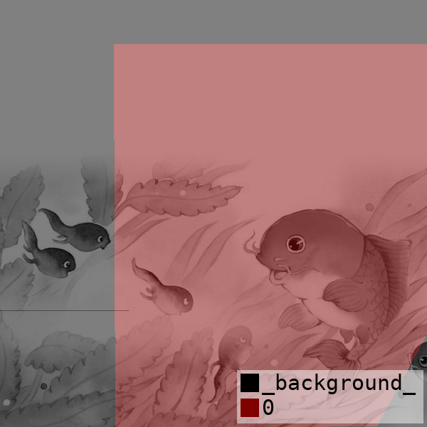
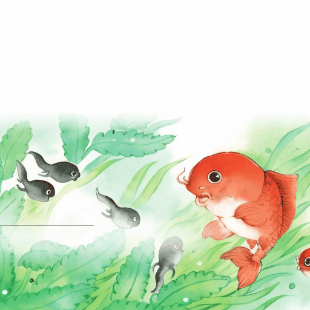
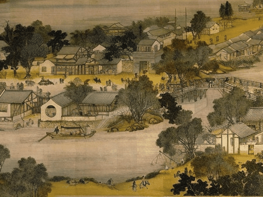

# AnimateAnything: Fine Grained Open Domain Image Animation with Motion Guidance
Project page: https://animationai.github.io/AnimateAnything/

Arxiv Link: https://arxiv.org/abs/2311.12886

https://github.com/alibaba/animate-anything/assets/1107525/e2659674-c813-402a-8a85-e620f0a6a454

| Reference Image  | Motion Mask | GIF |
| ------------- | ------------- | -------- |
|   |  |  The fish and tadpoles are playing.|

## News
**2023.12.27**: Support finetuning based on SVD model. Update SVD based animate_anything_svd_v1.0

**2023.12.18**: Update model to animate_anything_512_v1.02


## Getting Started
This repository is based on [Text-To-Video-Finetuning](https://github.com/ExponentialML/Text-To-Video-Finetuning.git).

### Create Conda Environment (Optional)
It is recommended to install Anaconda.

**Windows Installation:** https://docs.anaconda.com/anaconda/install/windows/

**Linux Installation:** https://docs.anaconda.com/anaconda/install/linux/

```bash
conda create -n animation python=3.10
conda activate animation
```

### Python Requirements
```bash
pip install -r requirements.txt
```

## Running inference
Please download the [pretrained model](https://cloudbook-public-production.oss-cn-shanghai.aliyuncs.com/animation/animate_anything_512_v1.02.tar) to output/latent, then run the following command. Please replace the {download_model} to your download model name:
```bash
python train.py --config output/latent/{download_model}/config.yaml --eval validation_data.prompt_image=example/barbie2.jpg validation_data.prompt='A cartoon girl is talking.'
```

To control the motion area, we can use the labelme to generate a binary mask. First, we use labelme to drag the polygon the reference image.


Then we run the following command to transform the labelme json file to a mask.

```bash
labelme_json_to_dataset qingming2.json
```


Then run the following command for inference:
```bash
python train.py --config output/latent/{download_model}/config.yaml --eval validation_data.prompt_image=example/qingming2.jpg validation_data.prompt='Peoples are walking on the street.' validation_data.mask=example/qingming2_label.jpg 
```



User can ajust the motion strength by using the mask motion model:
```bash
python train.py --config output/latent/{download_model}/
config.yaml --eval validation_data.prompt_image=example/qingming2.jpg validation_data.prompt='Peoples are walking on the street.' validation_data.mask=example/qingming2_label.jpg validation_data.strength=5
```
## Video super resolution
The model output low res videos, you can use video super resolution model to output high res videos.  For example, we can use [Real-CUGAN](https://github.com/bilibili/ailab/tree/main/Real-CUGANfor) cartoon style video super resolution:

```bash
git clone https://github.com/bilibili/ailab.git
cd ailab/Real-CUGAN
python inference_video.py
```

## Training

### Using Captions

You can use caption files when training video. Simply place the videos into a folder and create a json with captions like this:

```
[
      {"caption": "Cute monster character flat design animation video", "video": "000001_000050/1066697179.mp4"}, 
      {"caption": "Landscape of the cherry blossom", "video": "000001_000050/1066688836.mp4"}
]

```
Then in your config, make sure to set dataset_types to video_json and set the video_dir and video json path like this:
```
  - dataset_types: 
      - video_json
    train_data:
      video_dir: '/webvid/webvid/data/videos'
      video_json: '/webvid/webvid/data/40K.json'
```
### Process Automatically

You can automatically caption the videos using the [Video-BLIP2-Preprocessor Script](https://github.com/ExponentialML/Video-BLIP2-Preprocessor) and set the dataset_types and json_path like this:
```
  - dataset_types: 
      - video_blip
    train_data:
      json_path: 'blip_generated.json'
```

### Configuration

The configuration uses a YAML config borrowed from [Tune-A-Video](https://github.com/showlab/Tune-A-Video) repositories. 

All configuration details are placed in `example/train_mask_motion.yaml`. Each parameter has a definition for what it does.


### Finetuning anymate-anything
You can finetune anymate-anything with text, motion mask, motion strength guidance on your own dataset. The following config requires around 30G GPU RAM. You can reduce the training video resolution and frames to reduce GPU RAM:
```
python train.py --config example/train_mask_motion.yaml pretrained_model_path=<download_model>
```

### Finetune Stable Video Diffusion:
Stable Video Diffusion (SVD) img2vid model can generate high resolution videos. However, it does not have the text or motion mask control. You can finetune SVD with motioin mask guidance with the following commands and [pretrained model](https://cloudbook-public-production.oss-cn-shanghai.aliyuncs.com/animation/animate_anything_svd_v1.0.tar). This config requires around 80G GPU RAM.
```
python train_svd.py --config example/train_svd_mask.yaml pretrained_model_path=<download_model>
```

If you only want to finetune SVD on your own dataset without motion mask control, please use the following config:
```
python train_svd.py --config example/train_svd.yaml pretrained_model_path=<svd_model>
```

## Bibtex
Please cite this paper if you find the code is useful for your research:
```
@misc{dai2023animateanything,
      title={AnimateAnything: Fine-Grained Open Domain Image Animation with Motion Guidance}, 
      author={Zuozhuo Dai and Zhenghao Zhang and Yao Yao and Bingxue Qiu and Siyu Zhu and Long Qin and Weizhi Wang},
      year={2023},
      eprint={2311.12886},
      archivePrefix={arXiv},
      primaryClass={cs.CV}
}
```
## Shoutouts

- [Text-To-Video-Finetuning](https://github.com/ExponentialML/Text-To-Video-Finetuning.git)
- [Showlab](https://github.com/showlab/Tune-A-Video) and bryandlee[https://github.com/bryandlee/Tune-A-Video] for their Tune-A-Video contribution that made this much easier.
- [lucidrains](https://github.com/lucidrains) for their implementations around video diffusion.
- [cloneofsimo](https://github.com/cloneofsimo) for their diffusers implementation of LoRA.
- [kabachuha](https://github.com/kabachuha) for their conversion scripts, training ideas, and webui works.
- [JCBrouwer](https://github.com/JCBrouwer) Inference implementations.
- [sergiobr](https://github.com/sergiobr) Helpful ideas and bug fixes.
